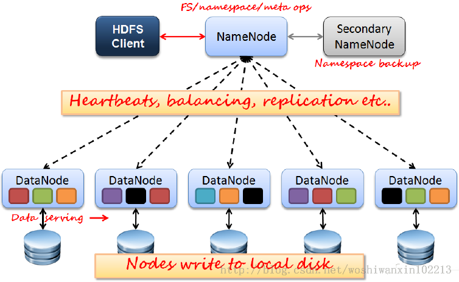

## Hadoop简介
1. 存储和计算：从一台机器到N台机器
与其说Hadoop是什么，不如来介绍一下Hadoop用来解决什么问题。在学习计算机的时候，通常都会关注两个关键的概念，存储和计算。当数据量比较小的时候，单台计算机的存储和计算能力完全可以满足。但是，随着互联网的发展，数据正在呈现井喷式增长。这就势必需要几百几千甚至数十万的机器去完成这样的存储和计算的任务，但是当机器变多以后，总是会遇到各种各样的问题，当处理大规模数据集的存储时候，可能会遇到网络问题——假如集群中的若干台机器断网，或者磁盘坏块等，处理大规模数据的时候，计算任务应该怎样划分，怎样分配资源，怎样调度等。
这些，都是Hadoop要处理的问题，简而言之，就是大数据的存储和计算。

2. Hadoop的关键概念
- HDFS：Hadoop分布式文件系统
- NameNode：Master节点，一般只有一个，管理HDFS的名称空间和数据块映射信息；配置副本策略；处理客户端请求。
- DataNode：数据节点，用来存储文件。
- MapReduce：一种简化的分布式编程模型。
- Yarn：Hadoop集群的资源管理系统。




## Hadoop环境搭建
在介绍Hadoop环境搭建之前，先要了解几个概念
1. Hadoop的运行模式
单机模式（Local (Standalone) Mode）
- 默认模式。
- 不对配置文件进行修改。
- 使用本地文件系统，而不是分布式文件系统。
- Hadoop不会启动NameNode、SecondaryNameNode、DataNode、ResourceManager、NodeManager等守护进程，Map()和Reduce()任务作为同一个进程的不同部分来执行的。
- 用于对MapReduce程序的逻辑进行调试，确保程序的正确。


伪分布式（Pseudo-Distributed Mode）
- 在一台主机上模拟多主机。
- Hadoop启动NameNode、DataNode、JobTracker、TaskTracker这些守护进程都在同一台机器上运行，是相互独立的Java进程。
- 在这种模式下，Hadoop使用的是分布式文件系统，各个作业也是由JobTraker服务，来管理的独立进程。在单机模式之上增加了代码调试功能，允许检查内存使用情况，HDFS输入输出，以及其他的守护进程交互。类似于完全分布式模式，因此，这种模式常用来开发测试Hadoop程序的执行是否正确。
- 修改3个配置文件：core-site.xml（Hadoop集群的特性，作用于全部进程及客户端）、hdfs-site.xml（配置HDFS集群的工作属性）、mapred-site.xml（配置MapReduce集群的属性）
- 格式化文件系统


分布式（Fully-Distributed Mode）
- Hadoop的守护进程运行在由多台主机搭建的集群上，是真正的生产环境。
- 在所有的主机上安装JDK和Hadoop，组成相互连通的网络。
- 在主机间设置SSH免密码登录，把各从节点生成的公钥添加到主节点的信任列表。
- 修改3个配置文件：core-site.xml、hdfs-site.xml、mapred-site.xml，指定NameNode和JobTraker的位置和端口，设置文件的副本等参数
- 格式化文件系统


扩展：高可用模式（High Availability）
由于在真实的环境中，可能存在NameNode单点失效问题，需要通过高可用机制，即两个NameNode，来提供更加可靠的服务，这样的话，当一台NameNode挂掉以后，可以切换到另外一台继续提供服务。通常提供服务的NameNode为active，备用的NameNode为standby。但是，如果是两台NameNode的话，就需要同步两台NameNode的状态，这个时候就需要引入Zookeeper来解决分布式一致性的问题。


## HDFS原理+实践
1. 认识HDFS
HDFS本质上是为了解决大文件存储，是一种分布式/高可用/高可靠/高性能的文件系统。HDFS主要包含两个组件，NameNode与DataNode，其中NameNode主要用来管理元数据，DataNode用来存储数据，在分布式HDFS架构中，通常会有一台NameNode，一台SecondaryNameNode,多台DataNode。（注：HA模式下会使用两台NN来避免单点问题）
2. 命令
hadoop fs -mkdir /test
hadoop fs- mkdir -P /user/test 递归的创建目录，如果上级目录不存在，自动创建
hadoop fs -put < local file > < hdfs file > 上传文件
hadoop fs -get < hdfs file > < local file or dir> 下载文件
hadoop fs -copyToLocal < local src > ... < hdfs dst >
hadoop fs -mv < hdfs file >  < hdfs file > 重命名或移动
hadoop fs -ls  / 列出文件
hadoop fs -ls -R / 递归的列出文件
hadoop fs -rm -R /user/* 递归删除文件,删除/user/下的所有文件
hadoop fs -count < hdfs path > 统计hdfs对应路径下的目录个数，文件个数，文件总计大小
hadoop fs -du < hdsf path>  显示hdfs对应路径下每个文件夹和文件的大小
hdoop fs -stat [format] < hdfs path >
hadoop archive -archiveName name.har -p < hdfs parent dir > < src >* < hdfs dst > 压缩归档

hadoop的很多文件操作命令与linux的文件操作命令很相似

示例1，上传文件并显示：
```shell
hadoop fs -mkdir /datawhale
hadoop fs -put ./jdk-8u171-linux-x64.tar.gz /datawhale/
hadoop fs -ls /datawhale/
```

3. API方式


## MapReduce原理+实践


## 参考
- [Hadoop官网](https://hadoop.apache.org/)
- [Hadoop分布式文件系统：架构和设计](https://hadoop.apache.org/docs/r1.0.4/cn/hdfs_design.html)
